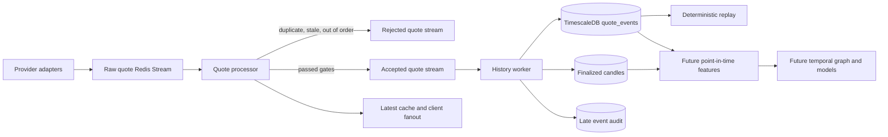

# Temporal Market Intelligence Graph

## Product position

Temporal Market Intelligence Graph is an explainable early-warning layer above the market-data gateway. It is not a database that guesses a price and it is not a trading recommendation engine.

The target product answers four auditable questions:

1. What changed?
2. Which instruments may react next, statistically?
3. Which evidence supports or opposes the signal?
4. What did the system actually know when the signal was created?

Every future signal must have an expiry, invalidation conditions, calibrated probability, provenance, and a recorded outcome. `LEADS` will mean statistical lead-lag evidence, never proven causality.

## Implemented foundation

This repository currently implements the trusted-data slice required before graph or ML work:

- normalized raw quote stream;
- validation and event-id deduplication;
- stale and out-of-order rejection;
- gap detection with degraded quality metadata;
- separate accepted and rejected Redis Streams;
- immutable accepted-event envelopes with `data_cutoff` and `accepted_at`;
- TimescaleDB-compatible accepted-event history;
- deterministic quote-derived 1s, 10s, 1m, and 5m OHLC candles;
- explicit late-event audit without silent candle mutation;
- deterministic replay at `1x`, `10x`, custom speed, or `max`;
- an isolated history worker outside quote delivery.

No graph features, prediction model, signal API, or claim of alpha is implemented yet.

## Runtime architecture



## Hot-path boundary

The API and WebSocket path does not write to PostgreSQL and does not run candle, graph, or ML calculations.

The quote processor performs only bounded Redis operations:

1. validate the normalized event;
2. claim the event ID through deduplication;
3. reject stale or out-of-order events;
4. attach quality metadata;
5. append the immutable envelope to the accepted stream;
6. update the latest cache and fan out the quote.

The history worker consumes the accepted stream independently. If it is unavailable, accepted entries remain pending in Redis and quote delivery continues.

## Accepted-event contract

```json
{
  "schema_version": "1.0",
  "event": {
    "event_id": "uuid",
    "symbol": "AAPL",
    "price": "215.42",
    "bid": "215.40",
    "ask": "215.44",
    "provider_timestamp": "2026-08-01T12:00:00Z",
    "received_at": "2026-08-01T12:00:00.035Z",
    "sequence": 1847291,
    "provider": "provider-name"
  },
  "quality": {
    "score": 1.0,
    "gap_detected": false,
    "out_of_order": false,
    "stale": false,
    "source_provider": "provider-name",
    "normalization_version": "1.0",
    "accepted_at": "2026-08-01T12:00:00.040Z"
  },
  "data_cutoff": "2026-08-01T12:00:00Z",
  "source_stream_id": "123-0"
}
```

`accepted_at` is the time the platform knew and accepted the event. `data_cutoff` is the latest source timestamp represented by the envelope. Future features must also carry `known_at` and may be joined only when `known_at <= prediction_time`.

## Candle semantics

Current provider-neutral quotes do not contain traded volume. Therefore candles expose `event_count`, not fake or inferred exchange volume.

Candle rules:

- bucket boundaries use UTC epoch time;
- open and close are selected by event time with event ID as a deterministic tie-breaker;
- high and low use all accepted quotes in the bucket;
- candle quality is the minimum quality score among its events;
- a configurable watermark allows bounded lateness;
- an event arriving after finalization is written to `late_quote_events` and does not mutate the candle;
- replay and live processing use the same `AcceptedQuoteEvent` and `CandleBuilder` code.

## Storage

TimescaleDB hypertables:

- `quote_events` partitioned by `provider_timestamp`;
- `candles` partitioned by `bucket_start`;
- `late_quote_events` partitioned by `provider_timestamp`.

Supporting PostgreSQL tables:

- `data_quality_intervals`;
- `market_sessions`.

Retention is disabled by default. It must be enabled only after provider licensing, backups, replay requirements, and audit retention have been agreed.

## Local operation

```bash
docker compose up --build
```

The stack includes `history-writer` and a TimescaleDB PostgreSQL 17 container.

Replay accepted events to JSONL:

```bash
smdg-replay \
  --from 2026-08-01T12:00:00Z \
  --to 2026-08-01T13:00:00Z \
  --symbol AAPL \
  --speed 10x \
  --output replay.jsonl
```

Replay into a dedicated Redis stream:

```bash
smdg-replay \
  --from 2026-08-01T12:00:00Z \
  --speed max \
  --output-stream smdg:accepted-quotes:replay:v1
```

Do not replay into the live accepted stream unless duplicate downstream processing is intentionally desired.

## Next implementation milestones

1. Point-in-time feature tables and leakage tests.
2. Market-regime snapshots.
3. Versioned temporal edges in PostgreSQL/TimescaleDB.
4. Statistical baseline versus market-only model.
5. Market-plus-graph model and calibration comparison.
6. Immutable prediction outcome ledger.
7. Shadow-mode signal API and propagation radar.

## Decision rule

Graph features may be described as a source of predictive value only if they repeatedly improve a non-graph model in purged walk-forward and live shadow evaluation after spread, latency, fees, and slippage.

If they do not, the graph remains useful for explanation, exploration, and portfolio shock propagation, but not as a claimed source of alpha.
