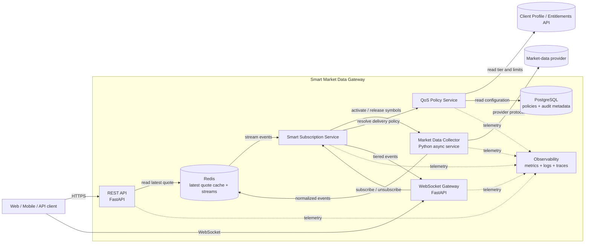

# C4 — Container Diagram

## Container view

## Responsibilities and state ownership

| Container | Responsibility | State ownership |
|---|---|---|
| REST API | Latest quote reads, public health and metadata endpoints, OpenAPI contract. | Stateless; reads Redis and policy services. |
| WebSocket Gateway | Client connections, protocol commands, snapshots, heartbeat, bounded delivery queues. | Connection-local state; durable/shared subscription state lives outside the process. |
| Market Data Collector | Provider lifecycle, subscribe/unsubscribe calls, normalization, reconnect behavior. | Provider connection and adapter-local sequence state. |
| Smart Subscription Service | Tracks subscribers, aggregates identical symbols, routes normalized events. | Logical subscription registry and subscriber counts. |
| QoS Policy Service | Resolves tier limits and applies update frequency, channel, and symbol policies. | Cached entitlements; source-of-truth remains external or PostgreSQL. |
| Redis | Latest quote cache, event streams, distributed coordination primitives. | Ephemeral operational state and bounded stream history. |
| PostgreSQL | Policy configuration, audit metadata, optional usage records. | Durable product configuration and audit data. |
| Observability | Aggregates metrics, logs, traces, and alerts. | Telemetry retention outside the request path. |

## Interaction rules

- Public synchronous calls use HTTPS/REST.
- Streaming client delivery uses WebSocket.
- Quote event transport inside the gateway uses Redis Streams.
- Provider adapters hide vendor-specific protocols from all other containers.
- The first subscriber activates an upstream symbol; the last subscriber releases it after a grace period.
- Quote delivery uses latest-value semantics for slow consumers; critical transactional events are outside this policy.
- Containers must emit correlation identifiers and provider/symbol metadata without logging credentials.

## Initial deployment boundary

The MVP may run REST, WebSocket, collector, subscription logic, and QoS in one Python process while keeping clear module boundaries. Redis remains a separate container. The logical containers can later be split into independently scalable services without changing public contracts.
