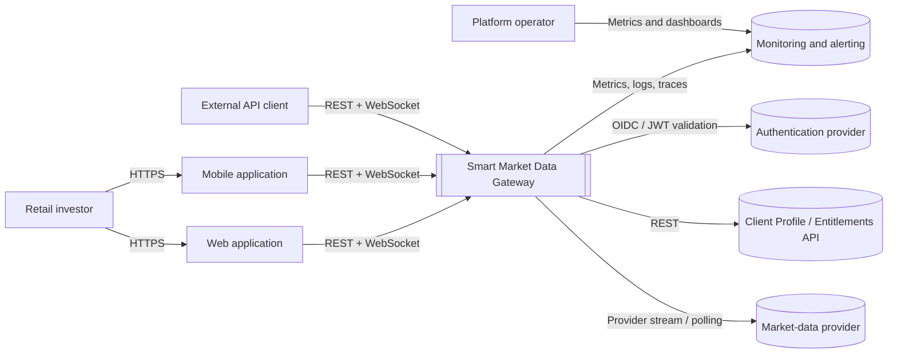

# C4 — System Context

## Purpose

Smart Market Data Gateway sits between market-data providers and client applications. It reduces duplicated upstream subscriptions, normalizes provider events, applies entitlement and QoS policies, and exposes one REST/WebSocket contract for web, mobile, and external API clients.

## Actors and external systems

| Element | Responsibility |
|---|---|
| Retail investor | Consumes quotes through web or mobile clients. |
| External API client | Consumes market data programmatically under an assigned tariff. |
| Web and mobile applications | Use the same public contracts and entitlement model. |
| Market-data provider | Supplies upstream quotes, snapshots, and optional market depth. |
| Client Profile / Entitlements API | Resolves customer tier, limits, and allowed data products. |
| Authentication provider | Issues or validates client identity tokens. |
| Monitoring and alerting | Receives operational telemetry and notifies operators. |

## System boundary

The gateway owns:

- provider adapters and normalized event schemas;
- active quote subscription aggregation;
- current quote caching and event transport;
- tier-specific quote frequency and subscription limits;
- REST and WebSocket contracts;
- slow-consumer protection and operational telemetry.

The gateway does **not** own:

- trade execution, order routing, or risk decisions;
- customer billing source-of-truth;
- exchange data rights or redistribution licenses;
- upstream provider availability.

## Primary flows

1. A client authenticates and connects over REST or WebSocket.
2. The gateway resolves entitlements and service tier.
3. Identical symbol requests are aggregated into one logical upstream subscription.
4. Provider-specific payloads are converted into the normalized quote schema.
5. The gateway caches the latest quote and distributes events according to QoS policy.
6. Metrics, logs, and health signals are emitted for operations and benchmarking.
