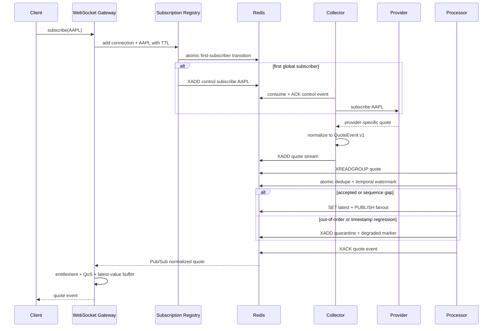

# End-to-end quote flow

## Failure paths

- **Provider disconnect:** collector reconnects with capped exponential backoff and jitter, then restores the active symbol set.
- **Duplicate event:** Redis dedupe rejects the repeated `event_id`; the stream entry is acknowledged and counted.
- **Sequence gap:** the event remains deliverable, but an anomaly metric and degraded marker are emitted so a provider adapter can request a snapshot.
- **Out-of-order or timestamp regression:** the event is atomically quarantined and cannot overwrite the latest quote or reach chart clients.
- **Malformed or poison event:** bounded retries are recorded; the payload moves to the dead-letter stream after the configured limit.
- **Processor restart:** unacknowledged stream entries remain pending and are reclaimed after the configured idle window. The atomic Redis decision prevents a retry from losing or double-publishing an already committed effect.
- **Gateway restart:** clients reconnect, authenticate, restore subscriptions, and receive the latest cached snapshot before live events.
- **Slow client:** newer unsent quotes replace older values for the same symbol. Healthy clients remain unaffected.
- **Last subscriber:** unsubscribe is delayed by a grace period to prevent churn; a new subscriber cancels release.
