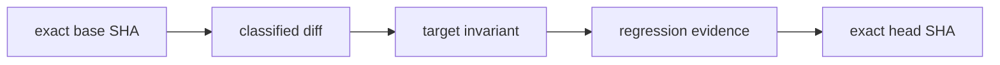

# Causal PR Gate

## Purpose

`Causal PR Gate` treats every pull request as an exact, reviewable transition from `pull_request.base.sha` to `pull_request.head.sha`. Green tests are supporting evidence, not a causal explanation and not merge authority.

The permanent required-check name is:

```text
Causal PR Gate
```

After the bootstrap pull request is reviewed and merged, the repository owner must add that exact status-check name to the required checks for the default branch.

## Exact-head binding

The workflow runs only on `pull_request` events and never on `pull_request_target`. It checks out:

- repository: `pull_request.head.repo.full_name`;
- ref: exact `pull_request.head.sha`;
- credentials: not persisted;
- history: sufficient to resolve the exact base object.

The analyzer rejects a stale event, a different checkout SHA, a missing Git object, or a dirty worktree. Evidence names and report bodies include the exact head SHA, run ID, and run attempt.

The classified diff compares the exact base tree directly with the exact head tree. It does not use the merge base, because changes present only on an advanced base are still part of the declared base-to-head tree transition.

For established installations, the workflow loads the analyzer, workflow validator, trust-root checker, and manifest from the exact base SHA. A pull request therefore cannot weaken the validator and immediately use the weaker head version to approve the same transition.

## Exact-tree trust root

`.github/causal-trust-root.json` stores the exact Git blob IDs of the protected causal-CI tree:

- the permanent workflow;
- the causal report analyzer;
- the workflow contract validator;
- the trust-root checker;
- causal contract tests;
- workflow mutation tests;
- exact-tree trust-root tests;
- selected CI and ownership surfaces.

The IDs are obtained from the actual Git tree, not calculated or copied by inspection.

In established mode:

1. the checker itself is loaded from the exact base SHA;
2. the base manifest blob must remain unchanged in the head;
3. every protected head file must have the blob ID declared by the base manifest;
4. any mismatch fails closed and requires a separate trust-root bootstrap.

This prevents an ordinary pull request from changing the workflow, validator, checker, manifest, and tests together to manufacture a false green result.

## Modes

### STRICT

STRICT mode applies when the diff contains runtime, API, CLI, schema, packaging, scripts, security, workflows, or unclassified files.

The pull-request body must contain substantive values for:

```markdown
### Failure path
### Invariant after change
### Regression evidence
### Residual risk
```

Empty sections, HTML-only templates, and explicit values such as `TODO`, `TBD`, `placeholder`, or `describe` fail closed. Ordinary sentences containing words such as `non-placeholder` are accepted.

Executable changes require either:

- a changed test file; or
- an exact existing repository test path in `Regression evidence`.

Workflow and CI-validator changes additionally require a changed causal, workflow, contract, or mutation test.

### LIGHTWEIGHT

LIGHTWEIGHT mode applies only when every affected path is documentation. Exact SHA, clean-worktree, exact-tree diff, provenance, and evidence generation still run. The four causal sections are optional.

Renames are classified by both source and destination. A move from executable code into documentation remains `STRICT`; only documentation-to-documentation renames can remain `LIGHTWEIGHT`.

## Causal graph

Every Markdown artifact contains a Mermaid graph:



This graph is an audit summary. It does not claim philosophical or scientific causality; it records the asserted software failure path, invariant, and evidence for one exact Git transition.

## Evidence artifacts

The gate writes:

```text
artifacts/causal/causal-pr-report.json
artifacts/causal/causal-pr-report.md
artifacts/causal/trust-root-verification.json
```

Artifact identity includes:

- exact head SHA;
- GitHub run ID;
- GitHub run attempt.

Uploads use `if-no-files-found: error`. The report does not copy the full PR body. URLs, common token formats, passwords, API keys, and private-key headers are redacted from Markdown and error details.

## Fork safety

The causal job has only `contents: read`, receives no repository secrets, and checks out the fork's exact head repository and SHA with credentials disabled. Base objects are fetched without credentials from the public base repository.

The causal analyzer and exact-tree checker run before any project code is executed. Validation dependencies are installed separately. The CodeQL job has explicit `contents: read`, `packages: read`, and `security-events: write` permissions and is skipped for fork pull requests where security-event upload authority is unavailable. The causal check still runs for forks.

## Workflow self-protection

Mutation tests reject:

- mutable external-action tags;
- a checkout ref other than exact PR head SHA;
- persisted checkout credentials;
- `pull_request_target`;
- fail-open artifact uploads;
- duplicate YAML keys;
- a changed stable check name;
- removal of the `edited` event;
- weakened permissions;
- job-level or step-level conditions that can skip required gate work;
- `continue-on-error` on workflow steps;
- removal of the base-bound trust-root checker;
- removal of the exact-tree regression test.

All external actions are pinned to full 40-character commit SHAs. Jobs have explicit timeouts and minimum permissions. Concurrency cancels stale runs for the same PR.

`CODEOWNERS` identifies trust surfaces and becomes an enforceable approval boundary only when repository settings require code-owner review. Solo-maintainer repositories are not required to enable that setting.

## Automated review policy for solo maintainers

A solo repository owner may use automated review agents instead of waiting for an unavailable human developer.

The merge protocol is:

1. request review from at least one available independent automated reviewer, such as Codex or CodeRabbit;
2. prefer two different reviewers for trust-root changes when both are available, but do not make the second reviewer a permanent availability dependency;
3. bind every request and conclusion to the current exact head SHA;
4. after any new commit, discard stale conclusions and request review again;
5. resolve every actionable finding and leave no unresolved review thread;
6. require `Causal PR Gate`, repository CI, security scans, and applicable CodeQL jobs to pass on the same head;
7. let the repository owner make the final merge decision manually.

A reviewer that is unavailable, rate-limited, or unable to inspect a Draft PR must be reported honestly. It does not permanently block a solo maintainer when another reviewer has completed the exact-head review and the causal evidence is green.

Review agents provide adversarial analysis, not merge authority. No bot, artifact, approval comment, or green status may trigger automatic merge by itself.

## Failure recovery

1. Do not weaken the check to make it green.
2. Open the JSON and Markdown evidence artifacts from the exact failed run.
3. Confirm the displayed base SHA and head SHA match the current PR event.
4. Correct the PR body, tests, workflow, implementation, or manifest mismatch.
5. Push a normal follow-up commit; do not force-push or rewrite history.
6. Let `synchronize` or `edited` start a new run. Concurrency cancels stale attempts.

A stale-head failure means the report was requested for a SHA different from the event payload. A trust-root mismatch means the proposed change is outside the authority of an ordinary feature PR.

## Bootstrap boundary

The repository had no pre-existing in-tree protected-files manifest before version 1. This bootstrap therefore reads the new checker and manifest from the exact head because the exact base SHA cannot contain them.

After bootstrap merge, future ordinary PRs use the exact base checker and base manifest. A later legitimate trust-root replacement must be a separate bootstrap. The old trust-root gate may and should reject that replacement because the current root cannot grant authority to its own successor. That single red trust-root result is an expected bootstrap boundary and must not be disabled or bypassed.

The bootstrap remains a separate Draft PR until the owner intentionally marks it ready. It is not mixed into a feature PR. For a solo maintainer, merge requires an exact-head automated review from at least one available reviewer, green causal evidence, green non-bootstrap checks, and resolution of all findings. Two automated reviewers are preferred for trust-root changes when available. The owner alone performs the manual merge.

## Residual limits

The gate does not independently control GitHub branch rules. A repository administrator can still alter branch settings, required checks, CODEOWNERS enforcement, or Actions policy. It also cannot prevent a sufficiently privileged administrator from rewriting repository state outside the PR process.

The owner must complete the final enforcement step after merge:

1. inspect the exact-head automated review and causal evidence, then merge manually;
2. add `Causal PR Gate` to required status checks on the default branch;
3. keep force-push disabled on the default branch;
4. enable human or code-owner approval later when a real team exists and the repository wants that additional boundary.
