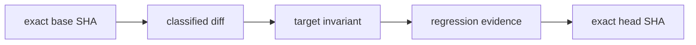

# Causal PR Gate

## Purpose

`Causal PR Gate` treats every pull request as an exact, reviewable transition from `pull_request.base.sha` to `pull_request.head.sha`. Green tests are supporting evidence, not a causal explanation and not merge authority.

The permanent required-check name is:

```text
Causal PR Gate
```

After the bootstrap pull request is independently reviewed and merged, the repository owner must add that exact status-check name to the required checks for the default branch.

## Exact-head binding

The workflow runs only on `pull_request` events and never on `pull_request_target`. It checks out:

- repository: `pull_request.head.repo.full_name`;
- ref: exact `pull_request.head.sha`;
- credentials: not persisted;
- history: sufficient to resolve the exact base object.

The analyzer rejects a stale event, a different checkout SHA, a missing Git object, or a dirty worktree. Evidence names and report bodies include the exact head SHA, run ID, and run attempt.

For established installations, the workflow prefers the analyzer and workflow validator stored at the exact base SHA. A pull request therefore cannot weaken the validator and immediately use the weaker head version to approve the same transition. During the first bootstrap, those base files do not yet exist, so the head implementation is used and the bootstrap boundary is logged explicitly.

## Modes

### STRICT

STRICT mode applies when the diff contains runtime, API, CLI, schema, packaging, scripts, security, workflows, or unclassified files.

The pull-request body must contain substantive values for:

```markdown
### Failure path
### Invariant after change
### Regression evidence
### Residual risk
```

Empty sections, HTML-only templates, and explicit values such as `TODO`, `TBD`, `placeholder`, or `describe` fail closed. Ordinary sentences containing words such as `non-placeholder` are accepted.

Executable changes require either:

- a changed test file; or
- an exact existing repository test path in `Regression evidence`.

Workflow and CI-validator changes additionally require a changed causal, workflow, contract, or mutation test.

### LIGHTWEIGHT

LIGHTWEIGHT mode applies only when every destination path is documentation. Exact SHA, clean-worktree, rename-aware diff, provenance, and evidence generation still run. The four causal sections are optional.

Renames are classified by destination path.

## Causal graph

Every Markdown artifact contains a Mermaid graph:



This graph is an audit summary. It does not claim philosophical or scientific causality; it records the asserted software failure path, invariant, and evidence for one exact Git transition.

## Evidence artifacts

The gate writes:

```text
artifacts/causal/causal-pr-report.json
artifacts/causal/causal-pr-report.md
```

Artifact identity includes:

- exact head SHA;
- GitHub run ID;
- GitHub run attempt.

Uploads use `if-no-files-found: error`. The report does not copy the full PR body. URLs, common token formats, passwords, API keys, and private-key headers are redacted from Markdown and error details.

## Fork safety

The causal job has only `contents: read`, receives no repository secrets, and checks out the fork's exact head repository and SHA with credentials disabled. Base objects are fetched without credentials from the public base repository.

The CodeQL job has explicit `contents: read`, `packages: read`, and `security-events: write` permissions and is skipped for fork pull requests where security-event upload authority is unavailable. The causal check still runs for forks.

## Workflow self-protection

Mutation tests reject:

- mutable external-action tags;
- a checkout ref other than exact PR head SHA;
- persisted checkout credentials;
- `pull_request_target`;
- fail-open artifact uploads;
- duplicate YAML keys;
- a changed stable check name;
- removal of the `edited` event;
- weakened permissions.

All external actions are pinned to full 40-character commit SHAs. Jobs have explicit timeouts and minimum permissions. Concurrency cancels stale runs for the same PR.

`CODEOWNERS` marks the workflow, analyzers, tests, PR template, reviewer instructions, and this document as owner-reviewed trust surfaces. Repository branch settings must require code-owner or equivalent independent review for that protection to have enforcement authority.

## Failure recovery

1. Do not weaken the check to make it green.
2. Open the JSON and Markdown evidence artifacts from the exact failed run.
3. Confirm the displayed base SHA and head SHA match the current PR event.
4. Correct the PR body, tests, workflow, or implementation.
5. Push a normal follow-up commit; do not force-push or rewrite history.
6. Let `synchronize` or `edited` start a new run. Concurrency cancels stale attempts.

A stale-head failure means the report was requested for a SHA different from the event payload. Re-run only after the PR head and event agree.

## Bootstrap boundary

The repository had no pre-existing protected-files manifest or causal trust-root validator before this change. This PR is therefore a bootstrap from the exact default-branch SHA recorded in the PR description.

A pre-existing trust-root gate, when present in another repository, may and should reject a PR that replaces its own root. That red result is an expected bootstrap boundary and must not be bypassed. This repository currently has no such manifest, so the corresponding exact-tree manifest test is not applicable for version 1.

The bootstrap must remain a separate Draft PR. It must not be mixed into a feature PR. Merge requires independent human/bot review of the exact head SHA. No bot review, artifact, approval comment, or green status grants merge authority.

## Residual limits

The gate does not independently control GitHub branch rules. A repository administrator can still alter branch settings, required checks, CODEOWNERS enforcement, or Actions policy. It also cannot prevent a sufficiently privileged administrator from rewriting repository state outside the PR process.

The owner must complete the final enforcement step after merge:

1. independently inspect and merge the bootstrap;
2. add `Causal PR Gate` to required status checks on the default branch;
3. require independent review for protected causal-CI paths;
4. keep force-push disabled on the default branch.
